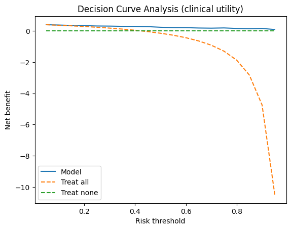
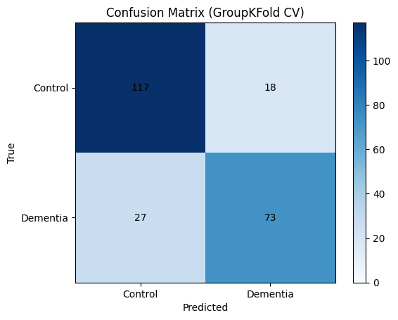
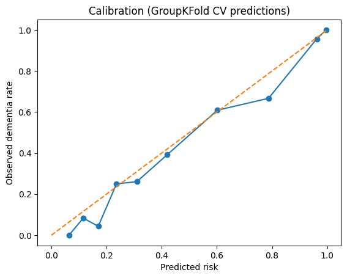
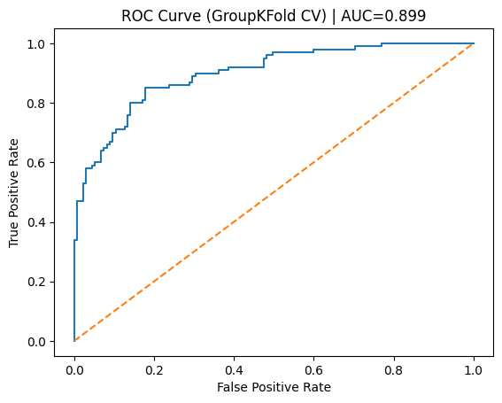
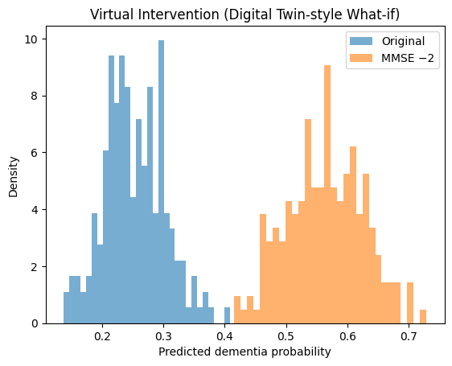
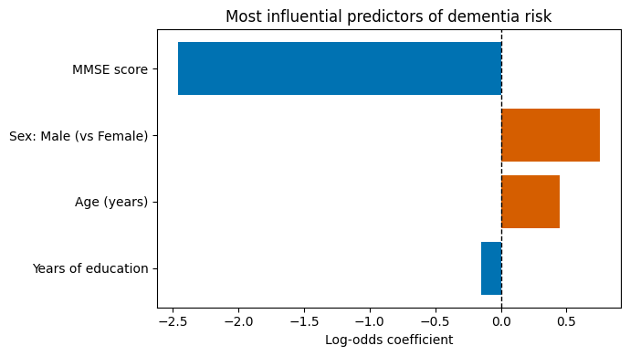

# Explainable Alzheimer’s Risk Modeling with Uncertainty and Simulation

This project builds an **interpretable machine learning pipeline** to estimate dementia risk using **clinical and demographic features** from the [OASIS-1 dataset](https://sites.wustl.edu/oasisbrains/home/oasis-1/). It emphasizes **individual-level uncertainty**, **what-if simulation**, and **transparent model interpretation**, which can be applied in line with modern standards for explainable healthcare AI.

---

## Overview

| Task                           | Approach Used                                       |
|-------------------------------|-----------------------------------------------------|
| **Prediction Target**         | Binary classification - Dementia (CDR > 0) vs Control (CDR = 0)                           |
| **Model**                     | Logistic Regression (with regularization)                |
| **Cross-validation**          | 5-fold **GroupKFold** (split by subject ID to avoid MR1/MR2 leakage)       |
| **Uncertainty Estimation**    | Bootstrap resampling (200 runs per subject)                              |
| **Virtual Simulation**        | MMSE -2 intervention ("what-if" digital twin)      |
| **Explanations**              | Log-odds coefficients and odds ratios for all features             |

---

## Dataset

- **Source**: [OASIS-1: Cross-sectional MRI dataset](https://sites.wustl.edu/oasisbrains/home/oasis-1/)
- **Subjects**: 416 individuals (aged 18–96), including non-demented and demented cases
- **Data used**: Clinical/demographic spreadsheet only (not imaging)
- **Key fields**: Age, MMSE (cognitive test), Education (years), Sex, Clinical Dementia Rating (CDR)

---

## Core Features

### 1. ROC-AUC Performance

---

### 2. Confusion Matrix (No Subject Leakage)

---

### 3. Probability Calibration

---

### 4. Clinical Utility: Decision Curve Analysis

---

### 5. Uncertainty-Aware Predictions
Each subject’s risk is estimated as a **distribution** via bootstrapping.

---

### 6. Digital Twin-Style What-If Simulation
Simulates cognitive decline by reducing the MMSE score by 2 points and recomputing the risk.

---

### 7. Model Interpretability (Log-odds Coefficients)
Features with the most impact on dementia risk.

---

## Code Structure

- `risk_modeling_for_alzheimer’s_disease_(oasis_1).py`  
  → Main pipeline: preprocessing, model training, evaluation, uncertainty, and simulation
- `Dataset/oasis1_clinical.xlsx`  
  → Downloaded automatically from the [OASIS site](https://sites.wustl.edu/oasisbrains/home/oasis-1/)
- `figures/`  
  → All output visualizations (saved via `matplotlib`)

---

## How to Run

This project is written for **Colab** or **Jupyter Notebook environments**.

1. Clone the repo
2. Open the notebook or Python script
3. Install required packages (scikit-learn, pandas, matplotlib)
4. Run all cells

---

## Why This Project Matters

This is a **minimal yet complete prototype** of a modern clinical risk model. It prioritizes:

- Transparency over black-box performance
- Individual-level risk, not only population metrics
- Scenario simulation instead of static prediction
- Ethical, leakage-free evaluation
  
---

## Author

Built by **Zareen Rahman**  
- Connect on [LinkedIn](https://www.linkedin.com/in/zareenrahman/)  
- Open to research collaborations or PhD positions in digital health, explainable ML, or computational medicine.

